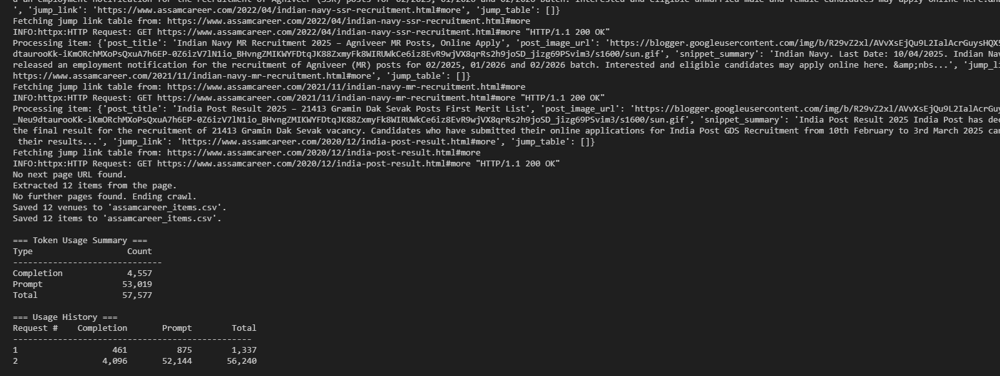

# Deep Seek Crawler

This project is a web crawler built with Python that extracts venue data from a website using asynchronous programming with Crawl4AI. It utilizes a language model-based extraction strategy and saves the collected data to a CSV file.


## Installation

1. **tach**

   Python 3.13.1
   pip 25.0.1 


2. **Install Dependencies**

   Use venv

   pip install -r requirements.txt


3. **Set Up Your Environment Variables**

   ```env
   OPENROUTER_API_KEY=your_groq_api_key_here
   ```


## Usage

python main.py

i am working on extract_next_page_url (not done yet)




## AI key

if you need AI Api key, openrouter given them for free
